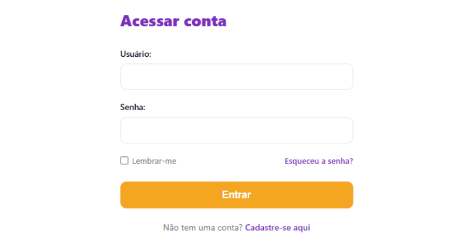

# App Salvaguarda Tutoria — Plataforma de Gestão de Tutorias 🎓

O **App Salvaguarda Tutoria** é uma plataforma web desenvolvida para otimizar e acompanhar o relacionamento entre tutores voluntários e estudantes (tutorados) do programa Salvaguarda. O sistema automatiza agendamentos de reuniões, gerenciamento de tarefas e a comunicação ativa entre os participantes.

<div align="center">
  
</div>

---

## 🚀 Status do Projeto & Funcionalidades Concluídas

### 🔒 Autenticação & Segurança (Módulo `usuarios`)
- **Acesso Customizado:** Diferenciação completa de painéis e fluxos de navegação baseada no perfil do usuário (`ADMIN`, `TUTOR` ou `TUTORADO`).
- **Segurança de Credenciais:** Fluxo robusto de redefinição e alteração de senhas com tokens nativos do Django.
- **Self-Service de Acesso:** Recuperação de senhas esquecidas com envio automático de e-mails HTML via SMTP do Gmail.
- **Variáveis de Ambiente:** Blindagem total de chaves secretas e tokens via arquivo `.env`.

### 📅 Agenda & Validação Avançada (Módulo `tutorias`)
- **Controle Dinâmico de Blocos:** Tutores gerenciam seus horários recorrentes de disponibilidade semanal.
- **Calendário Interativo:** Interface assíncrona integrada ao FullCalendar onde o tutorado visualiza slots livres e realiza agendamentos.
- **Prevenção de Conflitos (DRY):** Engine centralizada que impede marcações retroativas, sobreposições e agendamentos fora do expediente do tutor.
- **Histórico de Reuniões:** Controle de presenças, pautas, duração de chamadas e status (`CONFIRMADA`, `REALIZADA`, `CANCELADA`).
- **Cronograma de Estudos:** Módulo pedagógico para acompanhamento de cronogramas individuais por tutorado.
- **Ficha Diagnóstica:** Registro estruturado do perfil acadêmico do tutorado com versão para impressão.

### 📧 Notificações Inteligentes por E-mail
- **Templates Responsivos:** Disparo de e-mails dinâmicos em HTML com a identidade visual da aplicação.
- **Comunicação Proativa:** Alertas automáticos para novos agendamentos e cancelamentos para ambas as partes.
- **Entrega de Salas Virtuais:** Envio automático ou manual de links do Google Meet para o estudante.

### ✅ Tarefas (Módulo `tarefas`)
- Criação de tarefas com descrição, prazo e status.
- Tutorados visualizam e marcam tarefas como concluídas pelo painel.

### 📁 Materiais (Módulo `materiais`)
- Upload e listagem de arquivos (PDFs, apostilas, links) por tutores.
- Tutorados acessam os materiais compartilhados diretamente no painel.

---

## 🛠️ Tecnologias Utilizadas

- **Core Backend:** Python 3.14+ & Django 6.0+
- **Frontend / Interface:** Django Templates, HTML5, CSS3 Customizado (BEM/Variables) e Lucide Icons.
- **Scripts:** JavaScript Vanilla (manipulação de DOM, requisições assíncronas e Clipboard API).
- **Widgets de Terceiros:** FullCalendar e Toastify.js.
- **Banco de Dados:** SQLite (fase de desenvolvimento) e PostgreSQL (produção).
- **Containerização:** Docker + `.dockerignore` para builds reproduzíveis.
- **CI/CD:** GitHub Actions com pipeline de deploy automatizado (`deploy.yml`).

---

## 📁 Arquitetura do Projeto

A aplicação segue o padrão **MVT (Model-View-Template)** com modularização interna por *Separation of Concerns*:

```text
salvaguarda-project/
│
├── salvaguarda/                # Configurações globais (settings.py, urls.py)
│
├── usuarios/                   # Autenticação, perfis e controle de acesso (ACL)
│
├── tutorias/                   # Regras de negócio educacionais
│   ├── views/                  # Views modularizadas em pacote
│   │   ├── tutorados.py        # Gestão de vínculos e prontuários
│   │   ├── disponibilidade.py  # Lógica de slots e calendário
│   │   ├── reunioes.py         # Agendamentos e chamadas
│   │   └── cronograma.py       # Cronograma de estudos
│   ├── decorators.py           # Travas de acesso por tipo de conta
│   ├── emails.py               # Serviço SMTP isolado
│   └── utils.py                # Validador de concorrência horária (DRY)
│
├── tarefas/                    # Delegação e acompanhamento de metas
│
├── materiais/                  # Repositório de arquivos e links de estudo
│
└── static/                     # Assets globais (CSS, JS, imagens)
```

---

## 🗺️ Roadmap de Evolução

- [ ] **Avisos Automáticos por Fila (Celery):** Lembretes disparados automaticamente 24h antes de cada reunião.
- [ ] **Mensagens Internas:** Canal de comunicação direto entre tutor e tutorado na plataforma.
- [ ] **Painel de Progresso:** Gráficos de tarefas concluídas, reuniões realizadas e frequência.

---

## 🔧 Instalação e Execução

### Pré-requisitos

- Python 3.14+
- Git
- Docker (opcional, para execução containerizada)

### Execução Local

**1. Clone o repositório:**
```bash
git clone https://github.com/Alan-oliveir/salvaguarda-tutoria.git
cd salvaguarda-project
```

**2. Crie e ative o ambiente virtual:**
```bash
python -m venv .venv

# Windows:
.venv\Scripts\activate

# Linux/macOS:
source .venv/bin/activate
```

**3. Instale as dependências:**
```bash
pip install --no-cache-dir -r requirements.txt
```

**4. Configure as variáveis de ambiente:**

Crie um arquivo `.env` na raiz do projeto (use `.env.example` como referência):

```env
SECRET_KEY=seu-token-django
DEBUG=True
EMAIL_HOST_USER=seu-email@gmail.com
EMAIL_HOST_PASSWORD=sua-senha-de-aplicativo-de-16-digitos
```

> ⚠️ A senha de aplicativo do Gmail é gerada em **Conta Google → Segurança → Senhas de app**.

**5. Aplique as migrações:**
```bash
python manage.py migrate
python manage.py collectstatic --noinput
```

**6. Inicie o servidor:**
```bash
python manage.py runserver
```

Acesse em `http://127.0.0.1:8000`.

### Execução com Docker

O projeto já está dockerizado. Para subir o ambiente containerizado:

```bash
docker build -t salvaguarda .
docker run -p 8000:8000 --env-file .env salvaguarda
```

O pipeline de CI/CD via GitHub Actions (`deploy.yml`) realiza o deploy automaticamente a cada push na branch principal.
