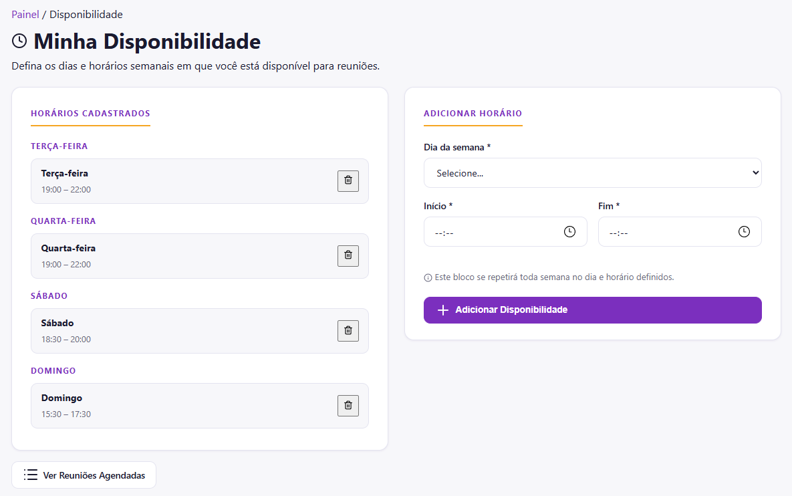
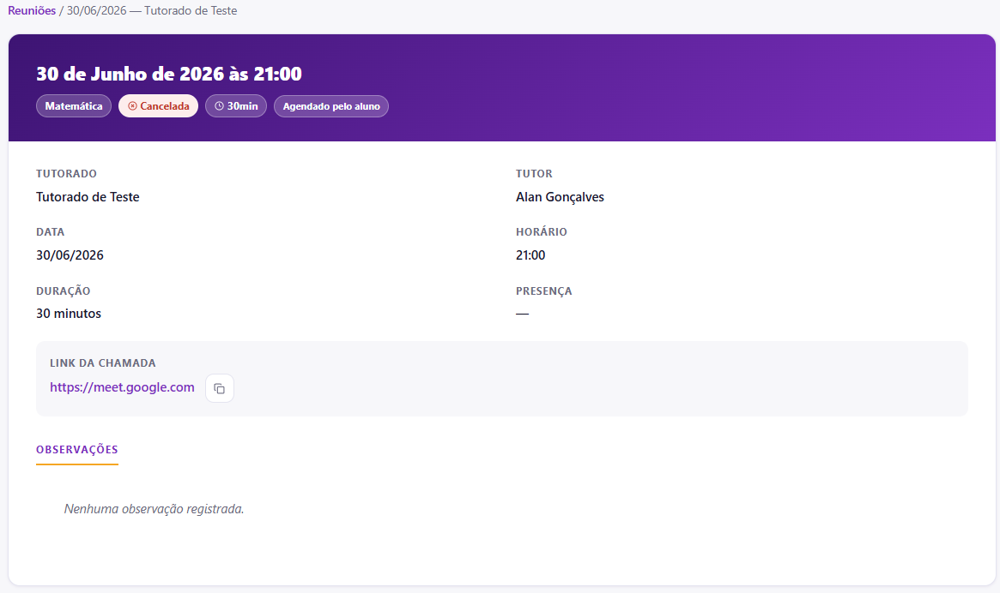

# Gestão de Agenda e Reuniões

O sistema automatiza os agendamentos através do cruzamento de dados assíncronos. O tutor declara sua disponibilidade e a plataforma se encarrega de expor esses horários e gerenciar as marcações dos estudantes.

## Configurando sua Disponibilidade Semanal

Antes de receber agendamentos, você deve definir quais são os seus blocos de horários livres para atendimento.

1. No painel, clique em **Minha Disponibilidade**.
2. No formulário localizado à direita da tela, configure os blocos recorrentes:

* **Dia da semana:** Selecione o dia específico para o atendimento.
* **Horário de Início e Fim:** Determine a janela de tempo em que você estará disponível para chamadas.
* Clique em **Adicionar Disponibilidade**.

::: info Recorrência Automática
Os blocos adicionados se repetirão automaticamente todas as semanas no sistema. Caso precise cancelar um horário fixo por tempo indeterminado, basta clicar no ícone de lixeira do cartão correspondente na coluna esquerda da tela.
:::

## Acompanhando os Detalhes de um Encontro

Sempre que um estudante reserva um slot livre através do calendário dele, a reunião é criada com o status inicial de confirmada.

Para auditar os dados de um compromisso:
1. Acesse a lista de marcações e selecione o encontro desejado.
2. A tela de detalhes consolidará todas as informações da chamada:

A tela apresenta:
* **Metadados de status:** Etiquetas indicando a disciplina, o status atual (Confirmada, Realizada ou Cancelada) e quem realizou a marcação.
* **Link da Chamada:** Campo protegido contendo a URL da sala virtual (como o Google Meet) com um botão dedicado para cópia rápida para a área de transferência.
* **Observações:** Histórico de pautas tratadas ou anotações pedagógicas registradas para aquela tutoria.