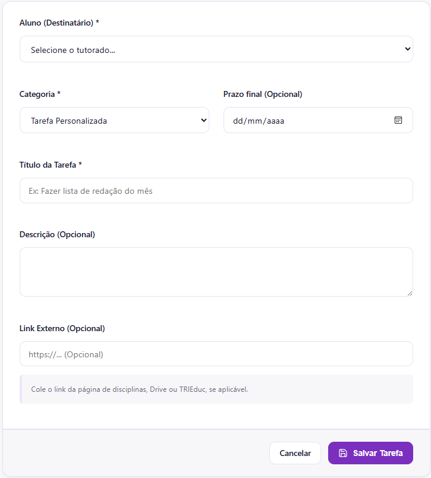
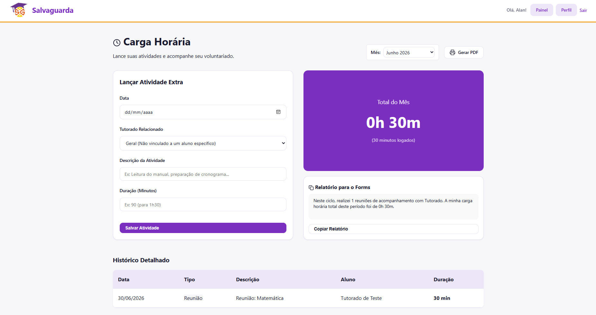

# Atribuição de Tarefas e Carga Horária

O encerramento do ciclo semanal de tutoria envolve a delegação de novas metas de estudo para os estudantes e o cômputo das horas dedicadas ao projeto voluntário.

## Atribuindo Tarefas para os Tutorados

Para direcionar os estudos semanais e acompanhar a evolução prática do estudante, você pode emitir ordens de serviço pedagógicas (tarefas):

1. Acesse a opção **Gerenciar Tarefas** e clique em criar ou atribuir.
2. Preencha o formulário com as especificações necessárias:

* **Aluno (Destinatário):** Selecione qual dos seus tutorados vinculados deve receber a meta.
* **Categoria:** Classifique a entrega (Tarefa Personalizada, Redação, Simulado).
* **Prazo final:** Estipule a data limite opcional para a conclusão.
* **Título e Descrição:** Insira as instruções claras sobre a execução da atividade.
* **Link Externo:** Se aplicável, adicione caminhos diretos para pastas organizadas no Google Drive, páginas específicas de disciplinas ou ferramentas externas de avaliação.

3. Clique em **Salvar Tarefa**. O exercício será inserido instantaneamente no painel do aluno selecionado.

## Controle de Carga Horária e Relatórios

A plataforma conta com um módulo de contabilidade de horas para facilitar a emissão de comprovantes de atividade voluntária e simplificar o preenchimento de formulários externos de auditoria.

1. Acesse a seção **Relatórios** no menu principal.

### Lançando Atividades Extras
O sistema computa automaticamente o tempo das reuniões cadastradas e realizadas. Caso você gaste tempo preparando cronogramas, corrigindo redações ou analisando manuais fora do horário de chamada, utilize o bloco **Lançar Atividade Extra**:
* Preencha a data, selecione o tutorado relacionado (ou marque como Geral), descreva a ação e informe o tempo gasto em minutos antes de salvar.

### Exportação de Dados
* **Relatório para o Forms:** A plataforma gera automaticamente um resumo textual estruturado indicando a contagem de reuniões e o total líquido de horas logadas no mês corrente. Você pode clicar em **Copiar Relatório** para colar esse texto em formulários de validação externos.
* **Geração de PDF:** Clique no botão **Gerar PDF** localizado no topo superior direito para extrair o documento oficial com o histórico detalhado e assinado das suas horas trabalhadas.