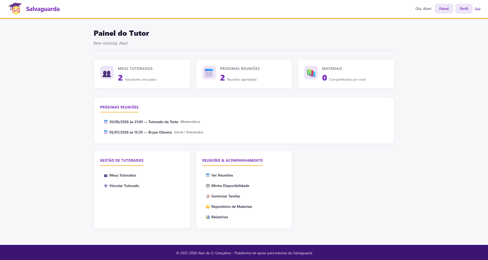
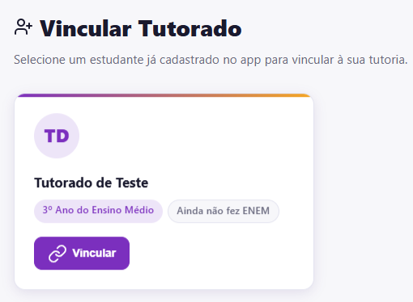
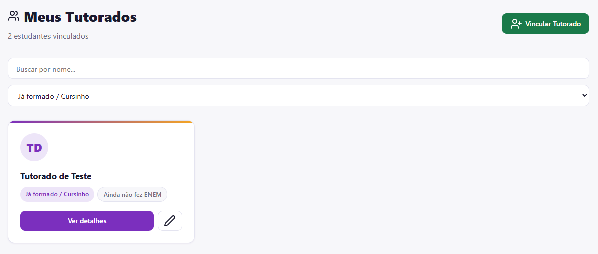

# Painel Geral e Gestão de Tutorados

Este guia orienta o tutor voluntário na navegação pelo seu painel administrativo e nos procedimentos de vinculação e acompanhamento dos seus estudantes.

## Conhecendo o Painel do Tutor

Ao efetuar o login, a plataforma identifica o perfil de acesso e carrega o painel centralizado de controle operacional.

A interface apresenta três blocos lógicos principais:
* **Indicadores quantitativos:** Cartões superiores com o total de estudantes vinculados, reuniões agendadas na semana e materiais compartilhados.
* **Próximas Reuniões:** Linha do tempo cronológica com os próximos compromissos confirmados, indicando data, horário, nome do estudante e a matéria da tutoria.
* **Menus Operacionais:** Atalhos inferiores para acesso rápido às ferramentas de gestão e relatórios.  

## Gerenciando os Estudantes

Para que um tutor possa orientar um estudante, este deve estar previamente cadastrado no sistema e vinculado à sua conta.

### Vinculando um Novo Tutorado
1. No menu lateral ou no painel inicial, clique em **Vincular Tutorado**.
2. A tela exibirá a listagem de estudantes que realizaram cadastro na plataforma e que ainda não possuem um orientador.

3. Identifique o estudante correto, valide informações como o ano escolar e clique no botão **Vincular**.

### Visualizando a Listagem de Tutorados
Após a vinculação, o estudante passa a constar na sua listagem oficial de acompanhamento.

1. Acesse a seção **Meus Tutorados**.
2. A página oferece filtros dinâmicos de busca por nome ou nível escolar.

3. Cada cartão de aluno exibe etiquetas de contexto (por exemplo, "Já formado / Cursinho" ou "Ainda não fez ENEM"). Para abrir o histórico pedagógico detalhado do aluno, fichas diagnósticas ou cronograma personalizado, clique em **Ver detalhes**.