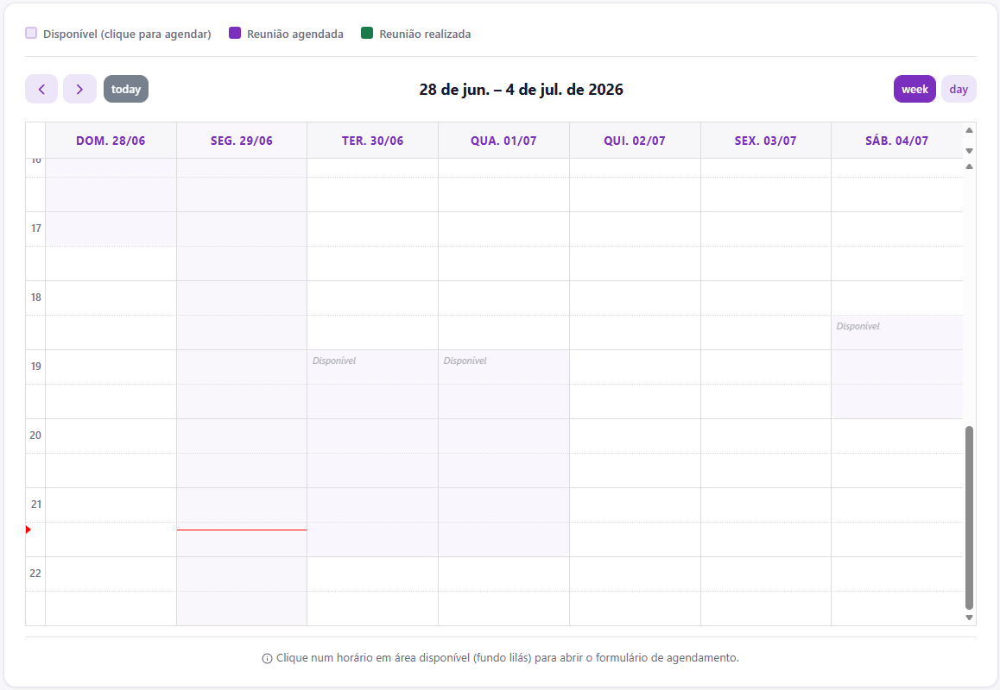

# Agendando suas Reuniões

O processo de agendamento no App Salvaguarda foi desenhado para que você encontre o melhor horário com o seu tutor sem precisar trocar dezenas de mensagens.

## Como marcar uma tutoria

1. Acesse o seu painel inicial.
2. No menu de navegação, clique em **Calendário**.
3. A interface interativa exibirá os blocos de horários disponibilizados pelo seu tutor para a semana atual.

4. Clique em um slot disponível, verifique os dados no modal de agendamento e clique em **Confirmar Agendamento**.

::: info Regra de Segurança
O sistema bloqueia automaticamente a seleção de horários retroativos.
:::

## Acessando a Sala Virtual

Após a confirmação da reunião pelo sistema, duas ações ocorrem automaticamente:

* Um e-mail de notificação formatado contendo os detalhes da reunião é enviado para seu email.
* O link de acesso à sala (Google Meet ou Zoom) é gerado pelo seu tutor e pode ser visualizado dentro do seu painel, na aba **Minhas Reuniões**.