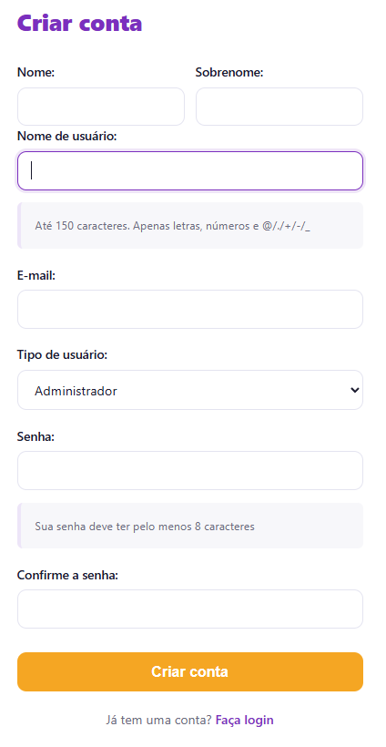
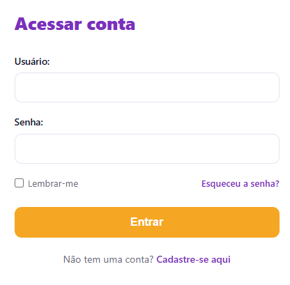
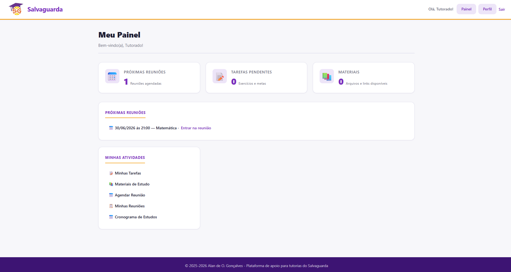

# Primeiro Acesso e Configuração do Perfil

Este guia orienta o tutorado no procedimento inicial de criação de conta, autenticação na plataforma e navegação pelo painel principal da aplicação Salvaguarda.

## Criação de Conta (Registro)

Se você ainda não possui credenciais cadastradas, o acesso inicial deve começar pela página de registro.

1. Na tela inicial ou na página de login, selecione a opção **Cadastre-se aqui**.
2. Preencha os campos obrigatórios conforme as especificações de segurança do sistema:

* **Nome de usuário:** Deve conter no máximo 150 caracteres, utilizando apenas letras, números e os caracteres `@`, `.`, `+`, `-` ou `_`.
* **Tipo de usuário:** Certifique-se de selecionar a opção correspondente ao seu perfil de estudante.
* **Senha:** Deve conter o limite mínimo de 8 caracteres configurado no motor de validação da plataforma.

3. Após preencher e validar os dados, clique no botão **Criar conta**.

## Autenticação (Login)

Para usuários já cadastrados no ecossistema da plataforma:

1. Acesse a página de login do sistema.
2. Insira o seu **Usuário** e **Senha** nos campos indicados.

3. Clique no botão **Entrar** para validar o acesso.

::: info Recuperação de Credenciais
Caso tenha esquecido sua senha, clique no link **Esqueceu a senha?**. O sistema iniciará o fluxo automatizado de redefinição, gerando um token seguro nativo do Django e despachando um link de recuperação formatado em HTML diretamente para o e-mail cadastrado.
:::

## Conhecendo o seu Painel

Ao efetuar o login com sucesso, o sistema analisa os seus privilégios de acesso e redireciona a navegação para o painel dinâmico exclusivo do tutorado.

A interface foi projetada em blocos limpos para facilitar a visualização de pendências pedagógicas imediatas:

### Indicadores Resumidos
* **Próximas Reuniões:** Exibe a contagem quantitativa de mentorias agendadas na semana.
* **Tarefas Pendentes:** Informa o total de exercícios ou metas de estudo determinados pelo tutor que ainda aguardam conclusão.
* **Materiais:** Indica a quantidade de arquivos de apoio pedagógico ou links externos indexados e disponíveis para consulta.

### Acesso Rápido
O bloco inferior esquerdo centraliza os links para as ferramentas operacionais do estudante:
* **Minhas Tarefas:** Relação detalhada de prazos e metas semanais.
* **Materiais de Estudo:** Repositório compartilhado para download de documentos.
* **Agendar Reunião:** Atalho para a interface assíncrona do FullCalendar integrada aos horários do seu tutor.
* **Minhas Reuniões:** Histórico de encontros e links diretos para as salas virtuais.
* **Cronograma de Estudos:** Visualização estruturada do planejamento pedagógico de longo prazo.