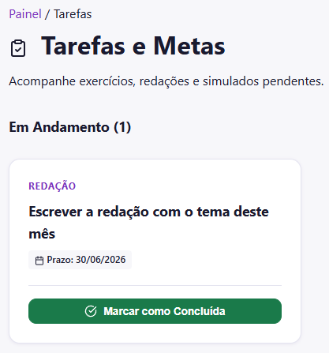
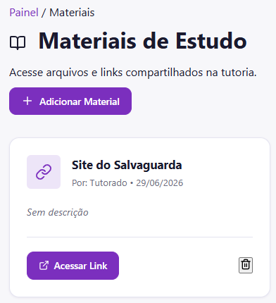

# Tarefas e Materiais

O acompanhamento pedagógico na plataforma Salvaguarda é estruturado através de duas ferramentas principais: o gestor de **Tarefas e Metas** e o repositório de **Materiais de Estudo**. Este guia detalha como interagir com ambos os módulos para manter sua rotina de estudos organizada.

## Tarefas e Metas

A seção de Tarefas foi desenvolvida para que você acompanhe exercícios, redações e simulados pendentes definidos em conjunto com o seu tutor.

Para gerenciar suas atividades:
1. Acesse o seu painel e clique na opção **Minhas Tarefas**.
2. A interface listará todas as atividades categorizadas pelo seu status atual (como **Em Andamento**).

*(A interface de tarefas exibe claramente as atividades em andamento e seus respectivos prazos)*

Cada cartão de atividade fornece as informações essenciais para a execução:
* **Categoria do bloco:** O tipo de atividade (por exemplo, Redação, Exercício, Leitura).
* **Descrição da meta:** O título indicando exatamente qual é a entrega esperada.
* **Prazo (Deadline):** A data limite estipulada para a conclusão.

Assim que você finalizar a atividade estipulada, clique no botão **Marcar como Concluída**. Essa ação atualizará o status no sistema e informará o seu tutor automaticamente sobre o seu progresso.  

## Materiais de Estudo

O módulo de Materiais atua como uma biblioteca centralizada, permitindo o acesso fácil a documentos, referências e links compartilhados durante a sua jornada de tutoria.

Para acessar ou inserir novos conteúdos:
1. Navegue até a seção **Materiais de Estudo** pelo menu principal.
2. Você visualizará uma lista com todos os recursos disponibilizados, contendo a identificação de quem enviou o material e a respectiva data.

*(O repositório de materiais permite gerenciar links externos e arquivos de forma centralizada)*

### Interagindo com os Materiais
* **Visualizar Conteúdo:** Clique no botão **Acessar Link** (para páginas externas) ou no botão de download (para arquivos em PDF ou documentos) para abrir o material referenciado.
* **Compartilhar Referências:** A plataforma permite uma troca bilateral de conhecimento. Caso você queira compartilhar um site, artigo ou arquivo útil com o seu tutor, basta utilizar o botão **Adicionar Material** localizado no topo da página.

::: info Gestão de Arquivos
Os materiais enviados ficam salvos de forma segura no repositório da sua tutoria e podem ser consultados ou excluídos (através do ícone de lixeira) a qualquer momento.
:::